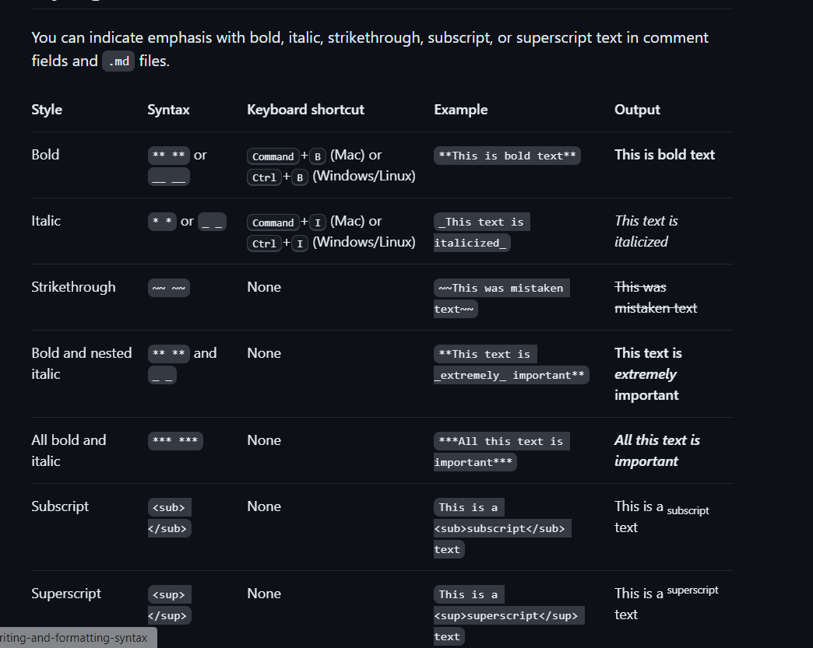

<picture>
  <source media="(prefers-color-scheme: dark)" srcset="https://user-images.githubusercontent.com/25423296/163456776-7f95b81a-f1ed-45f7-b7ab-8fa810d529fa.png">
  <source media="(prefers-color-scheme: light)" srcset="https://user-images.githubusercontent.com/25423296/163456779-a8556205-d0a5-45e2-ac17-42d089e3c3f8.png">
  
</picture>

## About me

Hi, I'm Mona. You might recognize me as GitHub's mascot.


| Rank | THING-TO-RANK |
|-----:|---------------|
|     1|               |
|     2|               |
|     3|               |


## About me

Hi, I'm Mona. You might recognize me as GitHub's mascot.

| Rank | Languages |
|-----:|-----------|
|     1| JavaScript|
|     2| Python    |
|     3| SQL       |


<details>
<summary>My top THINGS-TO-RANK</summary>

YOUR TABLE
<details open>


</details>


<details>
<summary>My top languages</summary>

| Rank | Languages |
|-----:|-----------|
|     1| JavaScript|
|     2| Python    |
|     3| SQL       |

</details>


---
> If we pull together and commit ourselves, then we can push through anything.

— Mona the Octocat


<!-- COMMENT -->




<table><thead><tr><th scope="col">Style</th><th scope="col">Syntax</th><th scope="col">Keyboard shortcut</th><th scope="col">Example</th><th scope="col">Output</th></tr></thead><tbody><tr><td>Bold</td><td><code>** **</code> or <code>__ __</code></td><td><kbd>Command</kbd>+<kbd>B</kbd> (Mac) or <kbd>Ctrl</kbd>+<kbd>B</kbd> (Windows/Linux)</td><td><code>**This is bold text**</code></td><td><strong>This is bold text</strong></td></tr><tr><td>Italic</td><td><code>* *</code> or <code>_ _</code>     </td><td><kbd>Command</kbd>+<kbd>I</kbd> (Mac) or <kbd>Ctrl</kbd>+<kbd>I</kbd> (Windows/Linux)</td><td><code>_This text is italicized_</code></td><td><em>This text is italicized</em></td></tr><tr><td>Strikethrough</td><td><code>~~ ~~</code></td><td>None</td><td><code>~~This was mistaken text~~</code></td><td><del>This was mistaken text</del></td></tr><tr><td>Bold and nested italic</td><td><code>** **</code> and <code>_ _</code></td><td>None</td><td><code>**This text is _extremely_ important**</code></td><td><strong>This text is <em>extremely</em> important</strong></td></tr><tr><td>All bold and italic</td><td><code>*** ***</code></td><td>None</td><td><code>***All this text is important***</code></td><td><em><strong>All this text is important</strong></em></td></tr><tr><td>Subscript</td><td><code>&#x3C;sub> &#x3C;/sub></code></td><td>None</td><td><code>This is a &#x3C;sub>subscript&#x3C;/sub> text</code></td><td>This is a <sub>subscript</sub> text</td></tr><tr><td>Superscript</td><td><code>&#x3C;sup> &#x3C;/sup></code></td><td>None</td><td><code>This is a &#x3C;sup>superscript&#x3C;/sup> text</code></td><td>This is a <sup>superscript</sup> text</td></tr></tbody></table>
<h2 id="quoting-text" tabindex="-1"><a class="heading-link" href="#quoting-text">Quoting text<span class="heading-link-symbol" aria-hidden="true"></span></a></h2>
<p>You can quote text with a <kbd>></kbd>.</p>
<pre><code class="hljs language-markdown">Text that is not a quote

<span class="hljs-quote">> Text that is a quote</span>
</code></pre>
<p>Quoted text is indented, with a different type color.</p>
<p><picture><source srcset="/assets/cb-13462/mw-1440/images/help/writing/quoted-text-rendered.webp" type="image/webp"></picture></p>
<div class="ghd-alert ghd-alert-accent ghd-spotlight-accent">
<p><strong>Note:</strong> When viewing a conversation, you can automatically quote text in a comment by highlighting the text, then typing <kbd>R</kbd>. You can quote an entire comment by clicking <svg version="1.1" width="16" height="16" viewBox="0 0 16 16" class="octicon octicon-kebab-horizontal" aria-label="The horizontal kebab icon" role="img"><path d="M8 9a1.5 1.5 0 1 0 0-3 1.5 1.5 0 0 0 0 3ZM1.5 9a1.5 1.5 0 1 0 0-3 1.5 1.5 0 0 0 0 3Zm13 0a1.5 1.5 0 1 0 0-3 1.5 1.5 0 0 0 0 3Z"></path></svg>, then <strong>Quote reply</strong>. For more information about keyboard shortcuts, see "<a href="/en/get-started/accessibility/keyboard-shortcuts" _originalHref="/get-started/accessibility/keyboard-shortcuts">Keyboard shortcuts</a>."</p>
</div>
<h2 id="quoting-code" tabindex="-1"><a class="heading-link" href="#quoting-code">Quoting code<span class="heading-link-symbol" aria-hidden="true"></span></a></h2>
<p>You can call out code or a command within a sentence with single backticks. The text within the backticks will not be formatted. You can also press the <kbd>Command</kbd>+<kbd>E</kbd> (Mac) or <kbd>Ctrl</kbd>+<kbd>E</kbd> (Windows/Linux) keyboard shortcut to insert the backticks for a code block within a line of Markdown.</p>
<pre><code class="hljs language-markdown">Use <span class="hljs-code">`git status`</span> to list all new or modified files that haven't yet been committed.
</code></pre>
<p><picture><source srcset="/assets/cb-24556/mw-1440/images/help/writing/inline-code-rendered.webp" type="image/webp"></picture></p>
<p>To format code or text into its own distinct block, use triple backticks.</p>
<pre>Some basic Git commands are:
```
git status
git add
git commit
```
</pre>
<p><picture><source srcset="/assets/cb-34231/mw-1440/images/help/writing/code-block-rendered.webp" type="image/webp"></picture></p>
<p>For more information, see "<a href="/en/get-started/writing-on-github/working-with-advanced-formatting/creating-and-highlighting-code-blocks" _originalHref="/get-started/writing-on-github/working-with-advanced-formatting/creating-and-highlighting-code-blocks">Creating and highlighting code blocks</a>."</p>
<p>If you are frequently editing code snippets and tables, you may benefit from enabling a fixed-width font in all comment fields on GitHub. For more information, see "<a href="/en/get-started/writing-on-github/getting-started-with-writing-and-formatting-on-github/about-writing-and-formatting-on-github#enabling-fixed-width-fonts-in-the-editor" _originalHref="/get-started/writing-on-github/getting-started-with-writing-and-formatting-on-github/about-writing-and-formatting-on-github#enabling-fixed-width-fonts-in-the-editor">About writing and formatting on GitHub</a>."</p>
<h2 id="supported-color-models" tabindex="-1"><a class="heading-link" href="#supported-color-models">Supported color models<span class="heading-link-symbol" aria-hidden="true"></span></a></h2>
<p>In issues, pull requests, and discussions, you can call out colors within a sentence by using backticks. A supported color model within backticks will display a visualization of the color.</p>
<pre><code class="hljs language-markdown">The background color is <span class="hljs-code">`#ffffff`</span> for light mode and <span class="hljs-code">`#000000`</span> for dark mode.
</code></pre>
<p><picture><source srcset="/assets/cb-11648/mw-1440/images/help/writing/supported-color-models-rendered.webp" type="image/webp"></picture></p>
<p>Here are the currently supported color models.</p>


<table><thead><tr><th scope="col">Color</th><th scope="col">Syntax</th><th scope="col">Example</th><th scope="col">Output</th></tr></thead><tbody><tr><td>HEX</td><td><code>`#RRGGBB`</code></td><td><code>`#0969DA`</code></td><td><picture><source srcset="/assets/cb-1558/mw-1440/images/help/writing/supported-color-models-hex-rendered.webp" type="image/webp"></picture></td></tr><tr><td>RGB</td><td><code>`rgb(R,G,B)`</code></td><td><code>`rgb(9, 105, 218)`</code></td><td><picture><source srcset="/assets/cb-1962/mw-1440/images/help/writing/supported-color-models-rgb-rendered.webp" type="image/webp"></picture></td></tr><tr><td>HSL</td><td><code>`hsl(H,S,L)`</code></td><td><code>`hsl(212, 92%, 45%)`</code></td><td><picture><source srcset="/assets/cb-2066/mw-1440/images/help/writing/supported-color-models-hsl-rendered.webp" type="image/webp"></picture></td></tr></tbody></table>
<div class="ghd-alert ghd-alert-accent ghd-spotlight-accent">
<p><strong>Notes:</strong></p>
<ul>
<li>A supported color model cannot have any leading or trailing spaces within the backticks.</li>
<li>The visualization of the color is only supported in issues, pull requests, and discussions.</li>
</ul>
</div>
<h2 id="links" tabindex="-1"><a class="heading-link" href="#links">Links<span class="heading-link-symbol" aria-hidden="true"></span></a></h2>
<p>You can create an inline link by wrapping link text in brackets <code>[ ]</code>, and then wrapping the URL in parentheses <code>( )</code>. You can also use the keyboard shortcut <kbd>Command</kbd>+<kbd>K</kbd> to create a link. When you have text selected, you can paste a URL from your clipboard to automatically create a link from the selection.</p>
<p>You can also create a Markdown hyperlink by highlighting the text and using the keyboard shortcut <kbd>Command</kbd>+<kbd>V</kbd>. If you'd like to replace the text with the link, use the keyboard shortcut <kbd>Command</kbd>+<kbd>Shift</kbd>+<kbd>V</kbd>.</p>
<p><code>This site was built using [GitHub Pages](https://pages.github.com/).</code></p>
<p><picture><source srcset="/assets/cb-8313/mw-1440/images/help/writing/link-rendered.webp" type="image/webp"></picture></p>
<div class="ghd-alert ghd-alert-accent ghd-spotlight-accent">
<p><strong>Note:</strong> GitHub automatically creates links when valid URLs are written in a comment. For more information, see "<a href="/en/get-started/writing-on-github/working-with-advanced-formatting/autolinked-references-and-urls" _originalHref="/get-started/writing-on-github/working-with-advanced-formatting/autolinked-references-and-urls">Autolinked references and URLs</a>."</p>
</div>
<h2 id="section-links" tabindex="-1"><a class="heading-link" href="#section-links">Section links<span class="heading-link-symbol" aria-hidden="true"></span></a></h2>
<p>You can link directly to a section in a rendered file by hovering over the section heading to expose <svg version="1.1" width="16" height="16" viewBox="0 0 16 16" class="octicon octicon-link" aria-label="the link" role="img"><path d="m7.775 3.275 1.25-1.25a3.5 3.5 0 1 1 4.95 4.95l-2.5 2.5a3.5 3.5 0 0 1-4.95 0 .751.751 0 0 1 .018-1.042.751.751 0 0 1 1.042-.018 1.998 1.998 0 0 0 2.83 0l2.5-2.5a2.002 2.002 0 0 0-2.83-2.83l-1.25 1.25a.751.751 0 0 1-1.042-.018.751.751 0 0 1-.018-1.042Zm-4.69 9.64a1.998 1.998 0 0 0 2.83 0l1.25-1.25a.751.751 0 0 1 1.042.018.751.751 0 0 1 .018 1.042l-1.25 1.25a3.5 3.5 0 1 1-4.95-4.95l2.5-2.5a3.5 3.5 0 0 1 4.95 0 .751.751 0 0 1-.018 1.042.751.751 0 0 1-1.042.018 1.998 1.998 0 0 0-2.83 0l-2.5 2.5a1.998 1.998 0 0 0 0 2.83Z"></path></svg>.</p>
<p><picture><source srcset="/assets/cb-55935/mw-1440/images/help/repository/readme-links.webp" type="image/webp"></picture></p>
<h2 id="relative-links" tabindex="-1"><a class="heading-link" href="#relative-links">Relative links<span class="heading-link-symbol" aria-hidden="true"></span></a></h2>
<p>You can define relative links and image paths in your rendered files to help readers navigate to other files in your repository.</p>
<p>A relative link is a link that is relative to the current file. For example, if you have a  README file in root of your repository, and you have another file in <em>docs/CONTRIBUTING.md</em>, the relative link to <em>CONTRIBUTING.md</em> in your README might look like this:</p>
<pre><code class="hljs language-text">[Contribution guidelines for this project](docs/CONTRIBUTING.md)
</code></pre>
<p>GitHub will automatically transform your relative link or image path based on whatever branch you're currently on, so that the link or path always works. The path of the link will be relative to the current file. Links starting with <code>/</code> will be relative to the repository root. You can use all relative link operands, such as <code>./</code> and <code>../</code>.</p>
<p>Relative links are easier for users who clone your repository. Absolute links may not work in clones of your repository - we recommend using relative links to refer to other files within your repository.</p>
<h2 id="images" tabindex="-1"><a class="heading-link" href="#images">Images<span class="heading-link-symbol" aria-hidden="true"></span></a></h2>
<p>You can display an image by adding <kbd>!</kbd> and wrapping the alt text in <code>[ ]</code>. Alt text is a short text equivalent of the information in the image. Then, wrap the link for the image in parentheses <code>()</code>.</p>
<p><code></code></p>
<p><picture><source srcset="/assets/cb-39745/mw-1440/images/help/writing/image-rendered.webp" type="image/webp"></picture></p>
<p>GitHub supports embedding images into your issues, pull requests, discussions, comments  and <code>.md</code> files. You can display an image from your repository, add a link to an online image, or upload an image. For more information, see "<a href="#uploading-assets">Uploading assets</a>."</p>
<div class="ghd-alert ghd-alert-accent ghd-spotlight-accent">
<p><strong>Note:</strong> When you want to display an image that is in your repository, use relative links instead of absolute links.</p>
</div>
<p>Here are some examples for using relative links to display an image.</p>


<table><thead><tr><th scope="col">Context</th><th scope="col">Relative Link</th></tr></thead><tbody><tr><td>In a <code>.md</code> file on the same branch</td><td><code>/assets/images/electrocat.png</code></td></tr><tr><td>In a <code>.md</code> file on another branch</td><td><code>/../main/assets/images/electrocat.png</code></td></tr><tr><td>In issues, pull requests and comments of the repository</td><td><code>../blob/main/assets/images/electrocat.png?raw=true</code></td></tr><tr><td>In a <code>.md</code> file in another repository</td><td><code>/../../../../github/docs/blob/main/assets/images/electrocat.png</code></td></tr><tr><td>In issues, pull requests and comments of another repository</td><td><code>../../../github/docs/blob/main/assets/images/electrocat.png?raw=true</code></td></tr></tbody></table>
<div class="ghd-alert ghd-alert-accent ghd-spotlight-accent">
<p><strong>Note</strong>: The last two relative links in the table above will work for images in a private repository only if the viewer has at least read access to the private repository that contains these images.</p>
</div>
<p>For more information, see "<a href="#relative-links">Relative Links</a>."</p>
<h3 id="specifying-the-theme-an-image-is-shown-to" tabindex="-1"><a class="heading-link" href="#specifying-the-theme-an-image-is-shown-to">Specifying the theme an image is shown to<span class="heading-link-symbol" aria-hidden="true"></span></a></h3>
<p>You can specify the theme an image is displayed for in Markdown by using the HTML <code>&#x3C;picture></code> element in combination with the <code>prefers-color-scheme</code> media feature. We distinguish between light and dark color modes, so there are two options available. You can use these options to display images optimized for dark or light backgrounds. This is particularly helpful for transparent PNG images.</p>
<p>For example, the following code displays a sun image for light themes and a moon for dark themes:</p>
<pre><code class="hljs language-html"><span class="hljs-tag">&#x3C;<span class="hljs-name">picture</span>></span>
  <span class="hljs-tag">&#x3C;<span class="hljs-name">source</span> <span class="hljs-attr">media</span>=<span class="hljs-string">"(prefers-color-scheme: dark)"</span> <span class="hljs-attr">srcset</span>=<span class="hljs-string">"https://user-images.githubusercontent.com/25423296/163456776-7f95b81a-f1ed-45f7-b7ab-8fa810d529fa.png"</span>></span>
  <span class="hljs-tag">&#x3C;<span class="hljs-name">source</span> <span class="hljs-attr">media</span>=<span class="hljs-string">"(prefers-color-scheme: light)"</span> <span class="hljs-attr">srcset</span>=<span class="hljs-string">"https://user-images.githubusercontent.com/25423296/163456779-a8556205-d0a5-45e2-ac17-42d089e3c3f8.png"</span>></span>
  <span class="hljs-tag">&#x3C;<span class="hljs-name">img</span> <span class="hljs-attr">alt</span>=<span class="hljs-string">"Shows an illustrated sun in light mode and a moon with stars in dark mode."</span> <span class="hljs-attr">src</span>=<span class="hljs-string">"https://user-images.githubusercontent.com/25423296/163456779-a8556205-d0a5-45e2-ac17-42d089e3c3f8.png"</span>></span>
<span class="hljs-tag">&#x3C;/<span class="hljs-name">picture</span>></span>
</code></pre>
<p>The old method of specifying images based on the theme, by using a fragment appended to the URL (<code>#gh-dark-mode-only</code> or <code>#gh-light-mode-only</code>), is deprecated and will be removed in favor of the new method described above.</p>
<h2 id="lists" tabindex="-1"><a class="heading-link" href="#lists">Lists<span class="heading-link-symbol" aria-hidden="true"></span></a></h2>
<p>You can make an unordered list by preceding one or more lines of text with <kbd>-</kbd>, <kbd>*</kbd>, or <kbd>+</kbd>.</p>
<pre><code class="hljs language-markdown"><span class="hljs-bullet">-</span> George Washington
<span class="hljs-bullet">*</span> John Adams
<span class="hljs-bullet">+</span> Thomas Jefferson
</code></pre>
<p><picture><source srcset="/assets/cb-7927/mw-1440/images/help/writing/unordered-list-rendered.webp" type="image/webp"></picture></p>
<p>To order your list, precede each line with a number.</p>
<pre><code class="hljs language-markdown"><span class="hljs-bullet">1.</span> James Madison
<span class="hljs-bullet">2.</span> James Monroe
<span class="hljs-bullet">3.</span> John Quincy Adams
</code></pre>
<p><picture><source srcset="/assets/cb-8162/mw-1440/images/help/writing/ordered-list-rendered.webp" type="image/webp"></picture></p>
<h3 id="nested-lists" tabindex="-1"><a class="heading-link" href="#nested-lists">Nested Lists<span class="heading-link-symbol" aria-hidden="true"></span></a></h3>
<p>You can create a nested list by indenting one or more list items below another item.</p>
<p>To create a nested list using the web editor on GitHub or a text editor that uses a monospaced font, like <a href="https://code.visualstudio.com/">Visual Studio Code</a>, you can align your list visually. Type space characters in front of your nested list item until the list marker character (<kbd>-</kbd> or <kbd>*</kbd>) lies directly below the first character of the text in the item above it.</p>
<pre><code class="hljs language-markdown"><span class="hljs-bullet">1.</span> First list item
<span class="hljs-bullet">   -</span> First nested list item
<span class="hljs-bullet">     -</span> Second nested list item
</code></pre>
<div class="ghd-alert ghd-alert-accent ghd-spotlight-accent">
<p><strong>Note</strong>: In the web-based editor, you can indent or dedent one or more lines of text by first highlighting the desired lines and then using <kbd>Tab</kbd> or <kbd>Shift</kbd>+<kbd>Tab</kbd> respectively.</p>
</div>
<p><picture><source srcset="/assets/cb-7202/mw-1440/images/help/writing/nested-list-alignment.webp" type="image/webp"></picture></p>
<p><picture><source srcset="/assets/cb-7206/mw-1440/images/help/writing/nested-list-example-1.webp" type="image/webp"></picture></p>
<p>To create a nested list in the comment editor on GitHub, which doesn't use a monospaced font, you can look at the list item immediately above the nested list and count the number of characters that appear before the content of the item. Then type that number of space characters in front of the nested list item.</p>
<p>In this example, you could add a nested list item under the list item <code>100. First list item</code> by indenting the nested list item a minimum of five spaces, since there are five characters (<code>100 .</code>) before <code>First list item</code>.</p>
<pre><code class="hljs language-markdown"><span class="hljs-bullet">100.</span> First list item
<span class="hljs-bullet">     -</span> First nested list item
</code></pre>
<p><picture><source srcset="/assets/cb-4906/mw-1440/images/help/writing/nested-list-example-3.webp" type="image/webp"></picture></p>
<p>You can create multiple levels of nested lists using the same method. For example, because the first nested list item has seven characters (<code>␣␣␣␣␣-␣</code>) before the nested list content <code>First nested list item</code>, you would need to indent the second nested list item by at least two more characters (nine spaces minimum).</p>
<pre><code class="hljs language-markdown"><span class="hljs-bullet">100.</span> First list item
<span class="hljs-bullet">       -</span> First nested list item
<span class="hljs-bullet">         -</span> Second nested list item
</code></pre>
<p><picture><source srcset="/assets/cb-7734/mw-1440/images/help/writing/nested-list-example-2.webp" type="image/webp"></picture></p>
<p>For more examples, see the <a href="https://github.github.com/gfm/#example-265">GitHub Flavored Markdown Spec</a>.</p>
<h2 id="task-lists" tabindex="-1"><a class="heading-link" href="#task-lists">Task lists<span class="heading-link-symbol" aria-hidden="true"></span></a></h2>
<p>To create a task list, preface list items with a hyphen and space followed by <code>[ ]</code>. To mark a task as complete, use <code>[x]</code>.</p>
<pre><code class="hljs language-markdown"><span class="hljs-bullet">-</span> [x] #739
<span class="hljs-bullet">-</span> [ ] https://github.com/octo-org/octo-repo/issues/740
<span class="hljs-bullet">-</span> [ ] Add delight to the experience when all tasks are complete :tada:
</code></pre>
<p><picture><source srcset="/assets/cb-64626/mw-1440/images/help/writing/task-list-rendered-simple.webp" type="image/webp"></picture></p>
<p>If a task list item description begins with a parenthesis, you'll need to escape it with <kbd>\</kbd>:</p>
<p><code>- [ ] \(Optional) Open a followup issue</code></p>
<p>For more information, see "<a href="/en/get-started/writing-on-github/working-with-advanced-formatting/about-task-lists" _originalHref="/get-started/writing-on-github/working-with-advanced-formatting/about-task-lists">About task lists</a>."</p>
<h2 id="mentioning-people-and-teams" tabindex="-1"><a class="heading-link" href="#mentioning-people-and-teams">Mentioning people and teams<span class="heading-link-symbol" aria-hidden="true"></span></a></h2>
<p>You can mention a person or <a href="/en/organizations/organizing-members-into-teams" _originalHref="/organizations/organizing-members-into-teams">team</a> on GitHub by typing <kbd>@</kbd> plus their username or team name. This will trigger a notification and bring their attention to the conversation. People will also receive a notification if you edit a comment to mention their username or team name. For more information about notifications, see "<a href="/en/account-and-profile/managing-subscriptions-and-notifications-on-github/setting-up-notifications/about-notifications" _originalHref="/account-and-profile/managing-subscriptions-and-notifications-on-github/setting-up-notifications/about-notifications">About notifications</a>."</p>
<div class="ghd-alert ghd-alert-accent ghd-spotlight-accent">
<p><strong>Note:</strong> A person will only be notified about a mention if the person has read access to the repository and, if the repository is owned by an organization, the person is a member of the organization.</p>
</div>
<p><code>@github/support What do you think about these updates?</code></p>
<p><picture><source srcset="/assets/cb-6949/mw-1440/images/help/writing/mention-rendered.webp" type="image/webp"></picture></p>
<p>When you mention a parent team, members of its child teams also receive notifications, simplifying communication with multiple groups of people. For more information, see "<a href="/en/organizations/organizing-members-into-teams/about-teams" _originalHref="/organizations/organizing-members-into-teams/about-teams">About teams</a>."</p>
<p>Typing an <kbd>@</kbd> symbol will bring up a list of people or teams on a project. The list filters as you type, so once you find the name of the person or team you are looking for, you can use the arrow keys to select it and press either tab or enter to complete the name. For teams, enter the @organization/team-name and all members of that team will get subscribed to the conversation.</p>
<p>The autocomplete results are restricted to repository collaborators and any other participants on the thread.</p>
<h2 id="referencing-issues-and-pull-requests" tabindex="-1"><a class="heading-link" href="#referencing-issues-and-pull-requests">Referencing issues and pull requests<span class="heading-link-symbol" aria-hidden="true"></span></a></h2>
<p>You can bring up a list of suggested issues and pull requests within the repository by typing <kbd>#</kbd>. Type the issue or pull request number or title to filter the list, and then press either tab or enter to complete the highlighted result.</p>
<p>For more information, see "<a href="/en/get-started/writing-on-github/working-with-advanced-formatting/autolinked-references-and-urls" _originalHref="/get-started/writing-on-github/working-with-advanced-formatting/autolinked-references-and-urls">Autolinked references and URLs</a>."</p>
<h2 id="referencing-external-resources" tabindex="-1"><a class="heading-link" href="#referencing-external-resources">Referencing external resources<span class="heading-link-symbol" aria-hidden="true"></span></a></h2>
<p>If custom autolink references are configured for a repository, then references to external resources, like a JIRA issue or Zendesk ticket, convert into shortened links. To know which autolinks are available in your repository, contact someone with admin permissions to the repository. For more information, see "<a href="/en/repositories/managing-your-repositorys-settings-and-features/managing-repository-settings/configuring-autolinks-to-reference-external-resources" _originalHref="/repositories/managing-your-repositorys-settings-and-features/managing-repository-settings/configuring-autolinks-to-reference-external-resources">Configuring autolinks to reference external resources</a>."</p>
<h2 id="uploading-assets" tabindex="-1"><a class="heading-link" href="#uploading-assets">Uploading assets<span class="heading-link-symbol" aria-hidden="true"></span></a></h2>
<p>You can upload assets like images by dragging and dropping, selecting from a file browser, or pasting. You can upload assets to issues, pull requests, comments, and <code>.md</code> files in your repository.</p>
<h2 id="using-emojis" tabindex="-1"><a class="heading-link" href="#using-emojis">Using emojis<span class="heading-link-symbol" aria-hidden="true"></span></a></h2>
<p>You can add emoji to your writing by typing <code>:EMOJICODE:</code>, a colon followed by the name of the emoji.</p>
<p><code>@octocat :+1: This PR looks great - it's ready to merge! :shipit:</code></p>
<p><picture><source srcset="/assets/cb-17229/mw-1440/images/help/writing/emoji-rendered.webp" type="image/webp"></picture></p>
<p>Typing <kbd>:</kbd> will bring up a list of suggested emoji. The list will filter as you type, so once you find the emoji you're looking for, press <strong>Tab</strong> or <strong>Enter</strong> to complete the highlighted result.</p>
<p>For a full list of available emoji and codes, see <a href="https://github.com/ikatyang/emoji-cheat-sheet/blob/master/README.md">the Emoji-Cheat-Sheet</a>.</p>
<h2 id="paragraphs" tabindex="-1"><a class="heading-link" href="#paragraphs">Paragraphs<span class="heading-link-symbol" aria-hidden="true"></span></a></h2>
<p>You can create a new paragraph by leaving a blank line between lines of text.</p>
<h2 id="footnotes" tabindex="-1"><a class="heading-link" href="#footnotes">Footnotes<span class="heading-link-symbol" aria-hidden="true"></span></a></h2>
<p>You can add footnotes to your content by using this bracket syntax:</p>
<pre><code class="hljs language-text">Here is a simple footnote[^1].

A footnote can also have multiple lines[^2].

[^1]: My reference.
[^2]: To add line breaks within a footnote, prefix new lines with 2 spaces.
  This is a second line.
</code></pre>
<p>The footnote will render like this:</p>
<p><picture><source srcset="/assets/cb-27019/mw-1440/images/help/writing/footnote-rendered.webp" type="image/webp"></picture></p>
<div class="ghd-alert ghd-alert-accent ghd-spotlight-accent">
<p><strong>Note</strong>: The position of a footnote in your Markdown does not influence where the footnote will be rendered. You can write a footnote right after your reference to the footnote, and the footnote will still render at the bottom of the Markdown.</p>
<p>Footnotes are not supported in wikis.</p>
</div>
<h2 id="alerts" tabindex="-1"><a class="heading-link" href="#alerts">Alerts<span class="heading-link-symbol" aria-hidden="true"></span></a></h2>
<p>Alerts are a Markdown extension based on the blockquote syntax that you can use to emphasize critical information. On GitHub, they are displayed with distinctive colors and icons to indicate the significance of the content.</p>
<p>Use alerts only when they are crucial for user success and limit them to one or two per article to prevent overloading the reader. Additionally, you should avoid placing alerts consecutively. Alerts cannot be nested within other elements.</p>
<p>To add an alert, use a special blockquote line specifying the alert type, followed by the alert information in a standard blockquote. Five types of alerts are available:</p>
<pre><code class="hljs language-markdown"><span class="hljs-quote">> [!NOTE]</span>
<span class="hljs-quote">> Useful information that users should know, even when skimming content.</span>

<span class="hljs-quote">> [!TIP]</span>
<span class="hljs-quote">> Helpful advice for doing things better or more easily.</span>

<span class="hljs-quote">> [!IMPORTANT]</span>
<span class="hljs-quote">> Key information users need to know to achieve their goal.</span>

<span class="hljs-quote">> [!WARNING]</span>
<span class="hljs-quote">> Urgent info that needs immediate user attention to avoid problems.</span>

<span class="hljs-quote">> [!CAUTION]</span>
<span class="hljs-quote">> Advises about risks or negative outcomes of certain actions.</span>
</code></pre>
<p>Here are the rendered alerts:</p>
<p><picture><source srcset="/assets/cb-50447/mw-1440/images/help/writing/alerts-rendered.webp" type="image/webp"></picture></p>
<h2 id="hiding-content-with-comments" tabindex="-1"><a class="heading-link" href="#hiding-content-with-comments">Hiding content with comments<span class="heading-link-symbol" aria-hidden="true"></span></a></h2>
<p>You can tell GitHub to hide content from the rendered Markdown by placing the content in an HTML comment.</p>
<pre>&#x3C;!-- This content will not appear in the rendered Markdown -->
</pre>
<h2 id="ignoring-markdown-formatting" tabindex="-1"><a class="heading-link" href="#ignoring-markdown-formatting">Ignoring Markdown formatting<span class="heading-link-symbol" aria-hidden="true"></span></a></h2>
<p>You can tell GitHub to ignore (or escape) Markdown formatting by using <kbd>\</kbd> before the Markdown character.</p>
<p><code>Let's rename \*our-new-project\* to \*our-old-project\*.</code></p>
<p><picture><source srcset="/assets/cb-5440/mw-1440/images/help/writing/escaped-character-rendered.webp" type="image/webp"></picture></p>
<p>For more information on backslashes, see Daring Fireball's "<a href="https://daringfireball.net/projects/markdown/syntax#backslash">Markdown Syntax</a>."</p>
<div class="ghd-alert ghd-alert-accent ghd-spotlight-accent">
<p><strong>Note</strong>: The Markdown formatting will not be ignored in the title of an issue or a pull request.</p>
</div>
<h2 id="disabling-markdown-rendering" tabindex="-1"><a class="heading-link" href="#disabling-markdown-rendering">Disabling Markdown rendering<span class="heading-link-symbol" aria-hidden="true"></span></a></h2>
<p>When viewing a Markdown file, you can click <strong>Code</strong> at the top of the file to disable Markdown rendering and view the file's source instead.</p>
<p><picture><source srcset="/assets/cb-13772/mw-1440/images/help/writing/display-markdown-as-source-global-nav-update.webp" type="image/webp"></picture></p>
<p>Disabling Markdown rendering enables you to use source view features, such as line linking, which is not possible when viewing rendered Markdown files.</p>
<h2 id="further-reading" tabindex="-1"><a class="heading-link" href="#further-reading">Further reading<span class="heading-link-symbol" aria-hidden="true"></span></a></h2>
<ul>
<li><a href="https://github.github.com/gfm/">GitHub Flavored Markdown Spec</a></li>
<li>"<a href="/en/get-started/writing-on-github/getting-started-with-writing-and-formatting-on-github/about-writing-and-formatting-on-github" _originalHref="/get-started/writing-on-github/getting-started-with-writing-and-formatting-on-github/about-writing-and-formatting-on-github">About writing and formatting on GitHub</a>"</li>
<li>"<a href="/en/get-started/writing-on-github/working-with-advanced-formatting" _originalHref="/get-started/writing-on-github/working-with-advanced-formatting">Working with advanced formatting</a>"</li>
<li>"<a href="/en/get-started/writing-on-github/getting-started-with-writing-and-formatting-on-github/quickstart-for-writing-on-github" _originalHref="/get-started/writing-on-github/getting-started-with-writing-and-formatting-on-github/quickstart-for-writing-on-github">Quickstart for writing on GitHub</a>"</li>